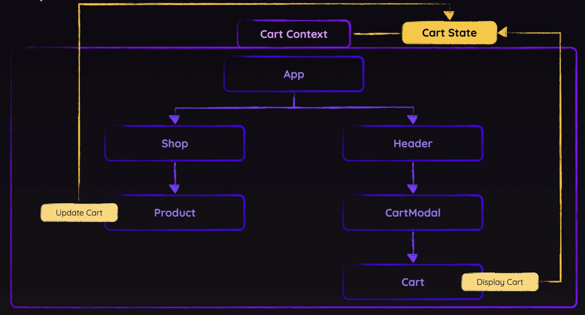

# App Overview

The app is a basic online store where user can add items to cart, update items in shopping cart, and check out. However, the checkout is not connecting to payment at all because this app is just for applying some knowledge about React concepts only.

- Live site (hosted with Firebase): https://basic-online-store--react.web.app/

- App Homepage:
  

- Component Tree Structure & State Management Flow:
  

## User Story

A shopper wants to shop clothes online and can add item to cart and update items in the shopping cart.

## Techniques applied

- Using React's Context API to avoid Props Drilling issue
- Outsourcing Context & State into a separate Provider Component
- Using useReducer() hook to manage state instead of using useState() hook
- Dispatching action using Reducer function

## Technologies Used

- React
- JavaScript
- HTML 5
- CSS

Note: I coded along while following React course by Academind @ https://github.com/academind
